# **My Blog**

![am i respomnsive( LÄNK TILL BILD)]

## About 
**My Blog** is a website application designed to post, edit, like and comment on others posts.
You can also check the creators profile, and bio's.
The purpose of the site is to share anything you want to share with others, It could be news,
gaming, food, feelings, toughts, or whatever!you like!

<u>Required tecgnologies:</u> 

**Test Accounts**

* For the purposes of testing the website and its features, a test-account have been created(as an admin).

* Test accounts allows you to test the websites features, such as editing profile, add a post, delete/edit posts, comment on posts and so on.

* A test account details are shown here: Username: admintest Password: admintest

## Table of Contents
SKA IICASFIXAS
- [**My Blog**](#my-blog)
  - [Table of Contents](#table-of-contents)
  - [About](#about)
  - [Features](#features)
  - [Getting Started](#getting-started)
    - [Prerequisites](#prerequisites)
    - [Installation](#installation)

# **Project Purpose**

## Target Audience

The target audience for this Django blog is broad and inclusive. The blog is designed to cater to a diverse range of users, including:

1. **Blog Readers**: Anyone interested in reading and exploring blog posts on various topics.

2. **Blog Writers**: Individuals who wish to contribute by creating and publishing their own blog posts.

3. **Editors**: Users who want to edit and improve existing blog posts.

4. **Community Interaction**: Users who want to engage with the content by liking, commenting, and sharing posts.

This blog is open for everyone, fostering a sense of community and collaboration. Whether you're a passionate writer, an avid reader, or simply looking to engage with interesting content, you're welcome to be a part of our blogging community.

# **UX** 

## **Project Scope**

* **Functionality**
    * To be able to sign-up using usernname, and a password
    * To be able to login/logout of the account
    * To be able to add, edit, delete, like posts as logged in
    * To be able to view posts, and bios of users
    * To be able to comment posts
    * To be able to edit user settings such as password
    * To be able to add categories as a user

* **Content requirments**
    * Clear, consistant info how to use the website
    * Easy navigation as nav-bar to guide the user
    * Simple form to make the user cofident to post
    * Responsive website that responds to the user

## **User Stories**

* As a **developer** getting started with **web development** using Django and Cloudinary, I want to install Django, set up a basic project, and integrate Cloudinary for media management
so that **I can create a web application that handles media uploads and serves them efficiently**
* As a new **user**, I wantto be able to create an account by providing my email address and a secure password so that **I can access the features of the blog**
* As a **registered user**, I want **to be able to log in using my email and password** so that **so that I can access my profile and interact with the blog**
* As a **logged-in user** I  want to **be able to create a new blog post** by providing  **a title, content, and optionally adding images or media**
* As a **logged-in user who created a post** I can **edit or delete my own posts** if in case **I need to make changes or remove outdated content**
* As a **user** I expect  **the blog to be responsive, and easily accessible on all kind of devices** so that **everyone can use the blog**
* As a **user**, I can update my profile information so that I can modify my user profile dashboard/information, like settings, name and so on
* As a **user**, I can comment, and like the blogposts, and also see how many likes I got on my posts
* As a **user**, I can add new categories, to implement it for my posts
* As a **first-time site visitor**, I can view a post and I can get information about the user who published the post
* As a **first-time site visitor**, I can view a landingpage/homepage so that I can get information about a website's purpose
* As a **first-time site visitor**, I can comment, and like the blogposts, and also see how many likes the user got on its post
* As an **admin**, I can view user profile information so that I can modify any needed user details or delete users.
* As an **admin**, I can access an admin profile so that I can create, edit and delete users, or edit them.

# **Design**

## **Website Structure**

* The website is structured into 9 principal pages
* All of the pages extend the same base, therefore producing a consistent style across the web-app
* Pages are the following:
    * **Navbar**
    The navbar is structured up very easy for the user, with a button and the header "**My Blog**", dropdown menu with "**categories**", where all the blog-categories are stored. A "**Register**" button for new users, and a "**Login**" button for the ones with registerd accounts already.
    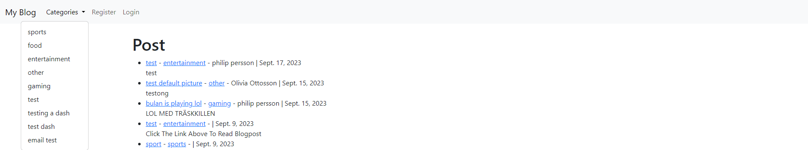
    
    * If the user is logged in, the navbar says: same "**My Blog**" button, and "**Categories**" dropdown menu, but then we come to the "**Add Post**" followed by "**Add Category**" since you can do this stuff as logged in. To the right, we find another dropdown menu, where the user sees the profile-name, the dropdown menu has 4 links. "**User settings**", "**Edit Profile Page**", "**Show profile page**" and a "**Logout**" button. 
    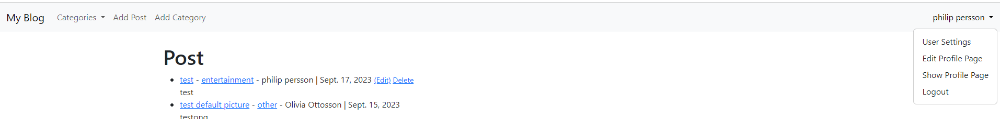
    
    * **Footer**
    The footer is a simple footer with copyright text, and 3 icons linked to social medias.
    
    

    * **Homepage**
    Here can we see the most recent posts for the blog.
    We have a link to the post itself, and also links to the category.
    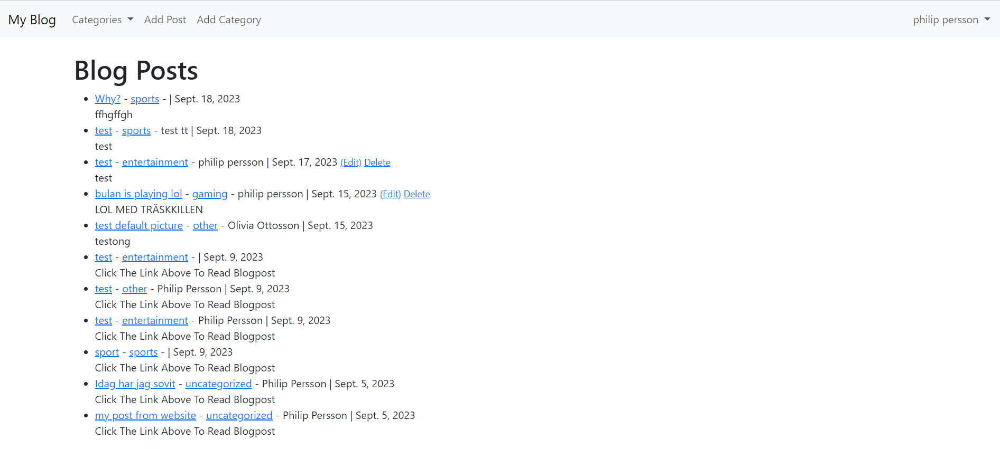

    * **Categories**
    In the category navbar, we see all the categories created by the users.
    If we post a blogpost, and we use the category, it will appear under its correct category.
      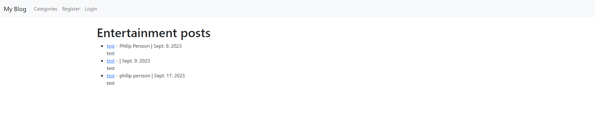
    
    * **Register** 
    This is a simple register form for the user to use, and it is created to assign a post by the user.
    Here, we want a username, first/last name, an email and a password.
    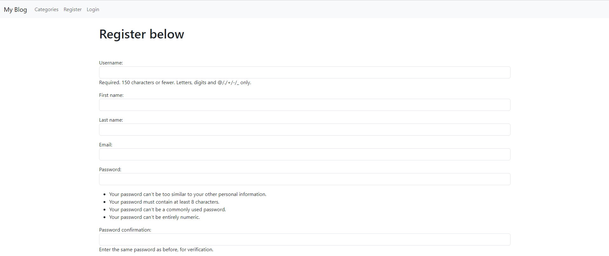
    

    * **Login**
    Here is a simple loginpage with username and password required. 
    If you dont have created an account yet, you can press the hyperlink Sign up Here, to get to the register page.
    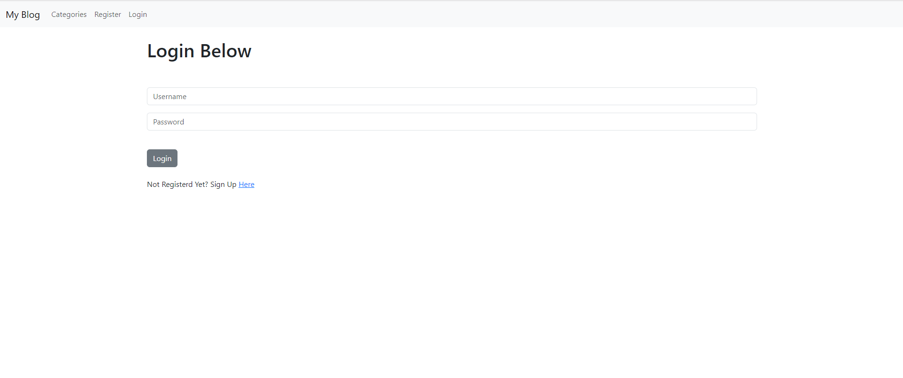

    ### As a logged in user
    
    * **Add Post**
    We can add a post, and then we enter a title, a title tag, choose a category that fits the post, and in the body, we type whatever we want to share!
    Then, we can post a header image. And then type a snippet for our post!
    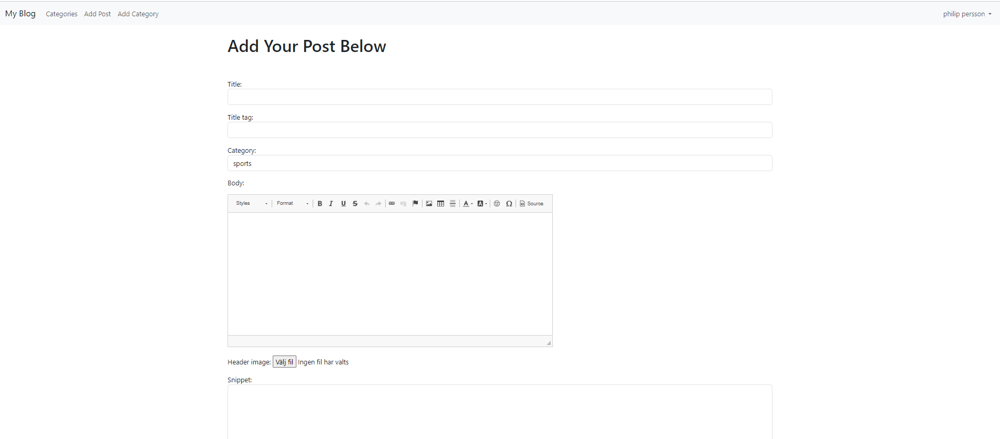

    * **Add Category**
    Very simple page, where you can add a category of anything, and it will appear in the **Categories** list aswell.
    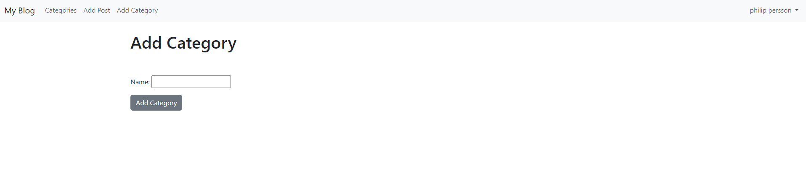

    * **Edit page**
    Edit/Delete a post as the user who created the page!
    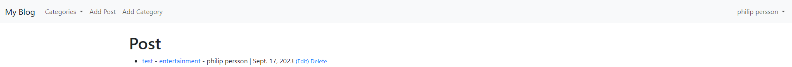

    * **Edit Profile**
    Here, you can edit your profile in the edit profile section
    

    * **Show Profile**
    Here, a user can see the profile name, and information like bio, and profile picture.
     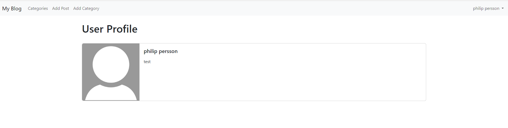
     
    * **User settings**
    Is where you can edit username, email, see your last login, and if youre an admin, is active, or something like that.
    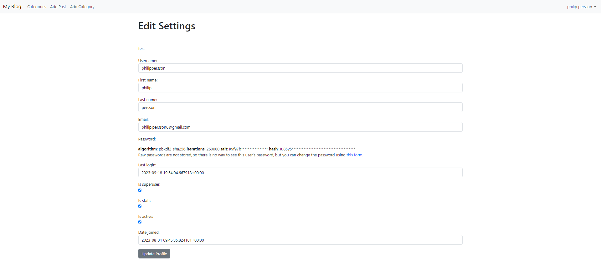

## **Relational Database**

* The project uses a relational database called [PostgreSQL](https://www.elephantsql.com/)

**Models**

* **User**
    * The User model contains information about each user that registers an account
    * It is part of the Django allauth library
    * username: The unique username chosen by the user for their account.
    * email: The email address associated with the user's account. This is used for account verification and communication.
    * password: The hashed password stored securely for user authentication.

* **Profile**
  * user: A one-to-one relationship with the User model, linking each profile to a specific user.
  * bio: A text field where users can provide a short bio or description about themselves.
  * profile_pic: An optional image field for users to upload a profile picture.
  * website_url: A URL field where users can provide a link to their personal website (optional).
  * facebook_url: A URL field for the user's Facebook profile (optional).
  * twitter_url: A URL field for the user's Twitter profile (optional).
  * instagram_url: A URL field for the user's Instagram profile (optional).
  * linkedin_url: A URL field for the user's LinkedIn profile (optional).
  
* **Post**
  * title: The title of the blog post.
  * header_image: An optional image field for a header image for the post.
  * title_tag: A short tagline or description for the post.
  * author: A foreign key relationship to the User model, indicating the author of the post.
  * body: A rich text field where the content of the post is stored (supports formatting).
  * post_date: The date when the post was created (auto-generated).
  * category: The category to which the post belongs (default is 'uncategorized' if not specified).
  * snippet: A short snippet or excerpt from the post.
  * likes: A many-to-many relationship with the User model, representing users who have liked the post.
    
  * Additional Method: total_likes(): A method that returns the total number of likes on the post.

total_likes(): A method that returns the total number of likes on the post.

* **Comment**
  * post: A foreign key relationship to the Post model, indicating the post on which the comment is made.
  * name: The name of the commenter.
  * body: The content of the comment.
  * date_added: The date and time when the comment was added (auto-generated).

## **Design**

* **Wireframe**
* A skeleton-design for my blog [here](static/readme_images/WIREFRAME.png).

## **Color Design**
 * Navbar color is used from the bootstrap
 * The footer is also from bootstrap color #3e4551;, along with the icons at the footer. 
    
    

# **Features**

## **Existing features**

## **Features to implement in the future**

## **CRUD Operations**

| **Operations** | All users | Auth. Users | Superusers |
| --- | --- | --- | --- |
| **View Home Page** | Yes | Yes | Yes |
| **Create Blogposts** | No | Yes | Yes |
| **Comment** | Yes | Yes | Yes |
| **Like** | No | Yes | Yes |
| **Add Category** | No | Yes | Yes |
| **Edit/Delete Post** | No | Yes | Yes |
| **Add/Edit/Delete Profile** | No | No | Yes |
| **Login** | No | Yes | Yes |
| **Register** | Yes | No | No |

# **Data Validation**
 * All empty input upon making a profile have default placeholders to inform user of requirements.
 * All input fields are required before updating profile information.
 * System will not allow non-registered users to create an account with a conflictive username or email.
 * System does not accept any username or password that is non-existent or incorrect.

# **Technologies and libraries used**

## **Languages**

The languages used for this site are:

* [HTML](https://html.spec.whatwg.org/multipage/)
* [CSS](https://www.w3.org/Style/CSS/Overview.en.html)
* [JavaScript](https://javascript.info/intro)
* [Python](https://www.python.org/)

## **Database Platform and Cloud Storage**

* [ElephantSQL Postgres](https://www.elephantsql.com/)
  This is a SQL database service offered by ElephantSQL, which we use to store and manage our data. It provides a reliable and scalable database solution for our application.
* [SQLite](https://www.sqlite.org/index.html)
  During the development of our application, we use SQLite as our SQL database engine. It's the default database engine that comes with the Django Framework. SQLite is lightweight and perfect for development purposes.
* [Cloudinary](https://cloudinary.com/home-102622)
  We utilize Cloudinary to handle the storage of images and static files in our application. Cloudinary offers a convenient and efficient way to store and manage media assets.
* [Heroku](https://id.heroku.com/login)
  Our application is deployed and hosted on Heroku. It's a cloud platform that allows us to run and manage our web application in a production environment. Heroku makes it easy to deploy, scale, and maintain our application.

# **Testing**

## **Introduction**

  Throughout the development stages of the website, we have conducted rigorous testing to ensure its quality and reliability. 
  This testing process involved various methods and tools, including:
  * Python Terminal for Backend Functionalities: We extensively used the Python terminal to test and validate the functionality of the backend of our website. This allowed us to interact directly with the backend components and ensure they were working as intended.
  * Google Developer Tools: Google Developer Tools played a crucial role in our testing process. It helped us inspect and debug the website's frontend components, ensuring that they were rendering correctly and functioning smoothly.
  * Manual Testing: Our team conducted thorough manual testing, where we interacted with the website as end-users would. This hands-on approach allowed us to identify any user interface issues, navigation problems, or functional glitches.
  
  By employing this comprehensive testing strategy, we have ensured that our website meets the highest standards of quality and provides an exceptional user experience.

## **Testing Accessibility and Performance**

* Testing for accessibility and performance is made from Google Chrome extention, called Lighthouse extension:

    * For Desktop:
    IMAGE PÅ RESULATAT 

    * For Mobile devices:
    IMAGE PÅ RESULTAT

## Validator Testing 
The HTML was validated using 

 

- My JavaScript was validated, without errors with 

- CSS showed no errors aswell, and validated with 

## Lighthouse
- The google chrome has a very good built-in performance-tool that is called Lighthouse.
  OK results, but unfortunatly CodeAnywhere are slowing down my rating on performace (prestanda)

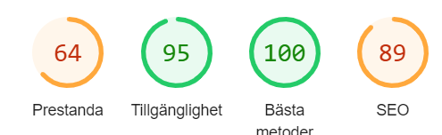
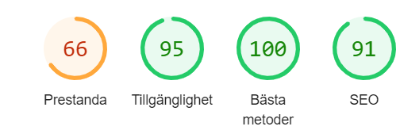

## **Code Validation**

* **W3C HTML Code Validator**

 * Each page of the deployed website was run through the [HTML Markup Validation Service](https://validator.w3.org/) and returned no errors.

* **W3C CSS Jigsaw Validator**

    * CSS code was tested with [W3C CSS Validator](https://jigsaw.w3.org/css-validator/) via direct input and returned no errors.

* **JSHint validator**

    * No custom JavaScript code has been written for this project, only what is included with Bootstrap4.

* **Python Validator**

    * All Python files across the application returned no errors.

# **Bugs during development**

## **Fixed bugs and solutions:**
When using smaller screens, the navigation bar felt quite chunky and took up a lot of the screen. navbar dropdown menu fixed
KOLLA GP CHAT frågor

## **Ongoing bugs:**

# **Development and deployment**
Throughout the development of this project, we utilized GitPod as our primary development environment. We maintained a disciplined approach by consistently committing and pushing our code to GitHub. This version control process allowed us to meticulously track and document the evolution of our website's development. It's worth noting that our GitPod environment was established using a template thoughtfully provided by Code Institute.

For users who wish to deploy this website locally, we will provide detailed instructions below. Additionally, we'll outline the steps required for deploying the website to Heroku, our chosen hosting service. We opted for Heroku primarily because of its robust database management capabilities, which align seamlessly with the needs of our website.

## **Local Deployment**

1. GitHub Login: Begin by logging into GitHub.

2. Select Repository: Locate and select the repository titled pphilippersson6/my-blog.p4

3. Copy Repository URL: Click on the "Code" toggle button within the repository and copy the URL (e.g., https://github.com/pphilippersson6/my-blog.p4.git).

4. Clone the Repository: In your integrated development environment (IDE), open the terminal and execute the git clone command using the copied URL (e.g., git clone https://github.com/pphilippersson6/my-blog.p4.git).

5. Repository Cloned: This action will clone the repository into your working environment.

6. Create the env.py File: Generate an env.py file and include it in the project's root folder. This file should typically be included in .gitignore to prevent public exposure. Add the following code to the env.py file, ensuring that you provide the relevant key-value pairs with correct values:

import os

os.environ['SECRET_KEY'] = 'ADDED_BY_YOU'
os.environ['DATABASE_URL'] = 'ADDED_BY_YOU'
os.environ['CLOUDINARY_URL'] = 'ADDED_BY_YOU'

7. Install Required Packages: Install the necessary packages specified in the requirements.txt file.

8. Configure Database Settings: In the settings.py file, configure the connection to either the Heroku Postgres Database or the local SQLite database.

9. Set Debug Mode: For local development, ensure that the DEBUG variable in the settings.py file is set to True.

10. Allow Local Host: Add localhost and 127.0.0.1 to the ALLOWED_HOSTS variable in the settings.py file.

11. Check Migrations: Verify the migration status by running python3 manage.py showmigrations.

12. Migrate the Database: Execute python3 manage.py migrate to perform the necessary database migrations.

13. Create Admin User: Use python3 manage.py createsuperuser to create a super/admin user for the application.

14. Start the Application: Finally, start the application by running python3 manage.py runserver. This will launch the local development server.

These steps will allow you to clone the repository and run the project locally with all the required configurations and dependencies.

## **Deployment to Heroku**

1. Create a Heroku Account: Start by creating an account on Heroku.

2. Create a New Heroku App: In your Heroku dashboard, create a new app and choose a suitable name for it. Additionally, select your desired region for hosting.

3. Database Configuration: Due to changes in the PostgreSQL Add-on, it's recommended to use ElephantSQL for your project's database instead of Heroku Postgres. Follow these steps:

4. Create an account on ElephantSQL.
Click on 'Create an instance'.
Provide a name for your plan, select the appropriate plan, choose a region, and data-center closest to your location.
After filling out the details, click 'Create instance'.
Copy the DATABASE_URL from your ElephantSQL dashboard and paste it into Heroku Config Vars in the app's Settings. Make sure your env.py in your project IDE also uses the same URL.
Environment Variables: Ensure that the DATABASE_URL is set as an environment variable both in Heroku's Config Vars and your local IDE's environment variables.

5. Create a Procfile: Generate a Procfile in your project directory with the following content: web: gunicorn project_name.wsgi.

6. Config Vars: Add your environment variables (from env.py) to Heroku's Config Vars.

7. Debug Mode: Set the DEBUG variable to False in the settings.py file.

8. Allowed Hosts: Add 'localhost' and 'project_name.herokuapp.com' to the ALLOWED_HOSTS variable in the settings.py file.

9. Check Migrations: Run python3 manage.py showmigrations to verify the status of your migrations.

10. Migrate Data: Execute python3 manage.py migrate to perform the necessary data migration to the database.

11. Create Admin User: Use python3 manage.py createsuperuser to create an admin user for the application.

12. GitHub Integration: Connect your Heroku app to GitHub and enable automatic deploys from the 'main' branch. Alternatively, you can choose to manually deploy.

13. Deploy: Click 'deploy' to initiate the deployment of your application to Heroku.

By following these steps, you'll successfully deploy your project to Heroku, taking into consideration the necessary configurations and database changes.

## **Libraries and other credits**

### Content
* [Code institute](https://learn.codeinstitute.net/courses/course-v1:CodeInstitute+PE_PAGPPF+2021_Q2/courseware/b3378fc1159e43e3b70916fdefdfae51/605f34e006594dc4ae19f5e60ec75e2e/) for inspiration, and help with readmefile
  
* [Code institute](https://learn.codeinstitute.net/courses/course-v1:CodeInstitute+FST101+2021_T1/courseware/dc049b343a9b474f8d75822c5fda1582/121ef050096f4546a1c74327a9113ea6/) for help with installations
  
* [pep8 checker](https://pep8ci.herokuapp.com/) for checking my code for errors.
  
* [Build fullstack booking app](https://www.youtube.com/watch?v=MpQbwtSiZ7E&ab_channel=CodingWithDawid) for helping me with the inspiration and structure of the site.
  
* [Am I Responsive](https://ui.dev/amiresponsive) for a nice layout in my readme file.
  
* [Heroku](https://heroku.com/) for deploying/storing/helps run the project.
  
* [Github](https://github.com) for deploying/storing/helps run the project.
  
* [Github_repo](https://github.com/pphilippersson6/battleship-game/edit/main/README.md) my own game, gave me inspiration and a template for the readme file.
  
* [Bootstrap](https://getbootstrap.com/) for the design and simple layout on site.
  
* [ElephantSQL](https://www.elephantsql.com/) for the database host service.

* [Django info](https://docs.djangoproject.com/en/4.2/) for information to learn about django.